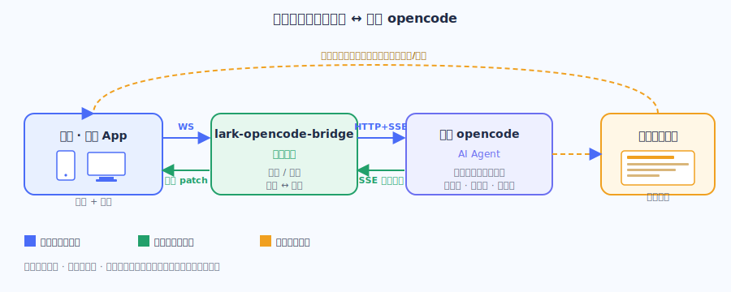
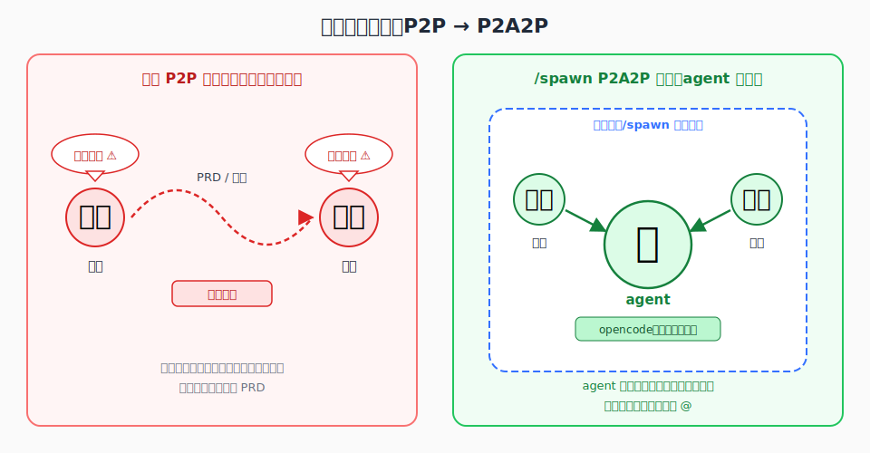
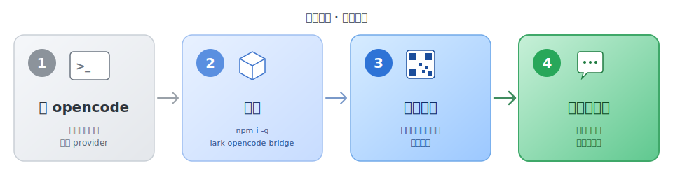

# lark-opencode-bridge —— 把你本地的 opencode 搬进飞书

> 🌉 **一句话：** 把你本地已经在用的 opencode 编程 agent 接进飞书。手机也能驱动、能拉群协作、会话能留存、飞书文档与附件原生打通。
>
> 云端不跑模型、不托管你的代码、不要你再注册任何账号——代码和执行始终在你本机。

👉 想立刻上手 → [安装指南（README.zh.md）](../README.zh.md)
👉 看 API/命令 → [README.md](../README.md)

---

## 这是什么

你在飞书里发一条消息——桥把它转发给你电脑上跑着的 opencode；opencode 在你指定的项目目录里干活（读代码、改文件、跑命令、调用 LSP），过程和结果以**一张实时刷新的飞书卡片**回传。

云端不跑模型、不托管你的代码、不要你再注册任何账号。代码和执行始终在你本机；飞书侧只负责"传话"和"展示"。



---

## 它和谁都不一样

新用户最容易混淆的地方。先把定位讲清楚：

| 类型 | 代表 | 差异 |
|---|---|---|
| **通用个人 agent** | OpenClaw / Hermes | 什么都沾一点；做严肃 coding 项目时深度不够 |
| **Claude Code 飞书桥** | 同类项目大多绑 Claude Code | 本项目接的是 **opencode**，自带模型自由、不锁定厂商 |
| **直接终端用 opencode** | opencode TUI | 不能移动、不能协作、关掉就散；本项目把它延伸到飞书生态 |

> ✅ **一句话定位：** 把一个**专业编程 agent（opencode）**接进飞书，而不是又造一个通用助手。

---

## 解决的痛点

你已经在用 opencode，但它有几个天生的不便：

| 痛点 | 直接用 opencode | 用这座桥 |
|---|---|---|
| 只能坐电脑前 | 终端锁死本机 | 手机/平板/任意设备的飞书都能发指令 |
| 单人作战 | 上下文锁在你一人脑里 | 拉群协作，多人围着同一个 agent |
| 会话易丢 | 关终端上下文就散 | `/spawn` 把会话钉成群，随时回去接着聊 |
| 喂材料麻烦 | 手动贴路径/代码 | 直接发飞书文件/截图、@机器人评论云文档 |

---

## 招牌能力：`/spawn` 工作群

`/spawn` 是本项目最值得讲的功能。它把"你与 opencode 的一次会话"实体化成一个飞书群：**一个群 = 一个独立 session = 一份项目上下文**。

| 💾 会话即留存 | 👥 会话即协作 | 🔁 P2P → P2A2P |
|---|---|---|
| 想继续哪个项目，回到对应群就行——上下文都在，不用重讲背景。 | 拉产品/研发/测试进同一个群，共享 agent 上下文，群里发消息即用（无需 @）。 | 从"人脑→人脑"升级到"人→agent→人"，agent 居中传递上下文。 |



> 📝 **举个例子：** 新功能上线时，产品在 `/spawn` 群里把背景、目标、边界讲给 opencode 并让它结合代码库理解；研发进同一个群，不必从头啃 PRD，直接问 agent "这块上下文是什么 / 做到哪了 / 为什么这么设计"。agent 成为双方共享、始终在线的"上下文中枢"。

---

## 其他核心能力

- **扫码即用** — 首次运行弹二维码，飞书一扫完成应用绑定。无需去开放平台手抄 App Secret。
- **流式卡片** — opencode 的思考、工具调用、文本输出实时更新在**同一张卡片**上，跑偏可随时点"终止"。
- **云文档评论** — 在飞书文档/表格里 @机器人写评论，agent 结合代码库读评论 + 上下文后把答案**回填到评论区**。
- **附件直传** — 截图、文件直接发给机器人，agent 读取本机下载的文件。报错截图让它定位、丢日志让它分析都行。
- **多工作空间** — `/ws` 在多个项目目录间切换，每个目录各自独立 session 互不串台。
- **可托管** — 支持后台守护进程（开机自启、崩溃自拉起），长期挂着随时响应。

---

## 典型场景

| 场景 | 说明 |
|---|---|
| 📱 **移动办公** | 通勤/出差时用手机飞书让公司电脑跑 opencode——改 bug、查逻辑、补测试。 |
| 🤝 **跨角色协作** | `/spawn` 一个项目群，产品交代需求、研发推进，都围着同一个 agent。 |
| 📄 **文档驱动开发** | 技术方案/接口文档里 @机器人，让它对照真实代码回答评论疑问。 |
| 🔍 **随手排障** | 报错截图或日志发给机器人，agent 边看图边读代码定位根因。 |

---

## 前提与适用边界

**用之前你需要：**

1. 本机装好 opencode 并配好至少一个模型 provider（支持 Anthropic / OpenAI / Gemini / OpenRouter 等）
2. Node.js ≥ 20
3. 一个飞书账号（首次扫码绑定，向导引导建应用）

| ✅ 适合谁 | ❌ 不适合谁 |
|---|---|
| 有真实 coding 需求、本机在用或愿意用 opencode、想把能力延伸到飞书与团队的人。 | 想要"什么都能聊"的通用助手（那是 OpenClaw / Hermes 的领域），或不想本机装 opencode 的人。 |

---

## 快速上手

四步走起：



```bash
# 1. 全局安装
npm i -g lark-opencode-bridge

# 2. 启动（首次会弹二维码，飞书扫码绑定）
lark-opencode-bridge run
```

绑定后给机器人发消息即可。常用命令：

| 命令 | 作用 |
|---|---|
| `/help` | 看所有命令 |
| `/spawn <主题>` | 开 1:1 工作群（招牌能力） |
| `/ws` | 列出/切换工作空间 |
| `/new` | 重置当前会话 |
| `/status` | 查看当前 session / cwd / agent / model |
| `/stop` | 中断正在跑的 prompt |

完整安装步骤请看 [README.zh.md](../README.zh.md)。

---

## FAQ

**Q：和 OpenClaw / Hermes 区别？**
那是通用全能 agent；本项目专注把**专业编程 agent**（opencode）接进飞书。认真写代码用专业的。

**Q：没装 opencode 能用吗？**
不能。这是"桥"不是"agent"，驱动的是你本机的 opencode。

**Q：会上传我的代码吗？**
不会。代码与执行都在本机，飞书侧只过消息和卡片。

**Q：为什么是 opencode 不是 Claude Code？**
opencode 开源、终端原生、**模型自由**——按任务挑模型、控成本、不被单一厂商锁定。如果你已经在用 opencode，这座桥让它直接长在飞书里。

---

> 🔗 项目地址：[GitHub](https://github.com/rorschachachxd/lark-opencode-bridge) · [npm](https://www.npmjs.com/package/lark-opencode-bridge)
